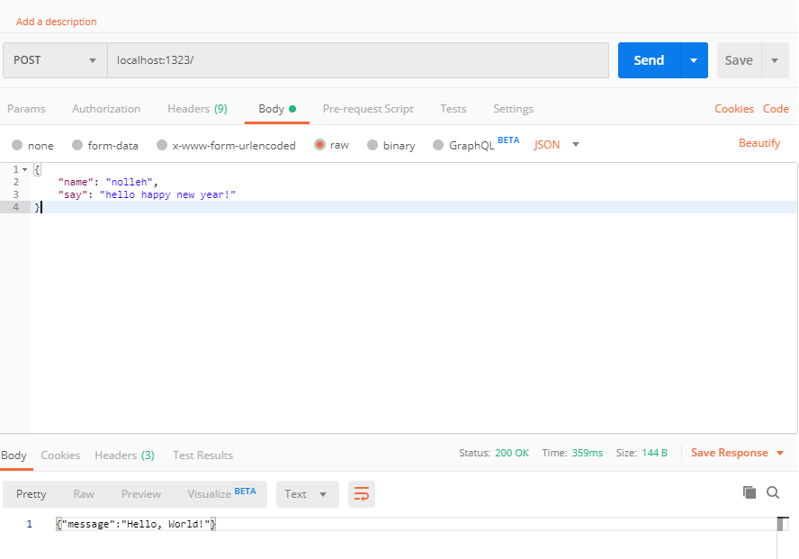
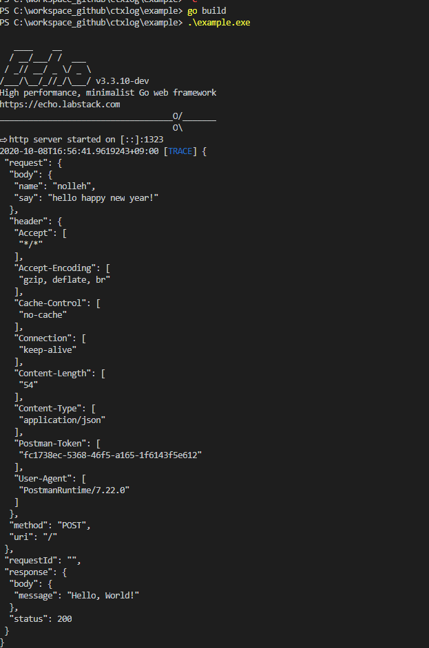

[](https://pkg.go.dev/github.com/nolleh/ctxlog)
[](https://opensource.org/licenses/MIT)

## ctxlog

---

echo middleware that print log for a api's request / response

if you write request / response like this,



then get ..



> you need only one line to show this request/response log !

`e.Use(middleware.CtxLogger())`

### Example Details

---

#### request

```json
{
  "name": "nolleh",
  "say": "hello happy new year!"
}
```

#### response

```json
{
  "message": "Hello, World!"
}
```

#### go

[example/main.go](https://github.com/nolleh/ctxlog/blob/master/example/main.go)

```go
func main() {

    // Echo instance
    e := echo.New()

    /// this one line! (other codes are for start echo frameworks / http handler)
    e.Use(middleware.CtxLogger())

    e.POST("/", hello)
    e.Logger.Fatal(e.Start(":1323"))
}

// http Handler
func hello(c echo.Context) error {
	// type Request struct {
	// 	Name string `json:"name"`
	// 	Say string `json:"say"`
	// }
	// var request Request
	// c.Bind(&request)
	type Result struct {
		Message string `json:"message"`
	}

	// and if you want to add some additional log, use it as log stream!
	// experience colorized, and pretty json formatting
	// ctxlog.Log().Info(request)

	result := Result{"Hello, World!"}
	json, _ := json.Marshal(result)
	return c.String(http.StatusOK, string(json))
}


```

#### Output

colored by log level

```go
// if you uncomment ctxlog.Log().Info(request), above
2020-10-08T16:40:46.4543276+09:00 [INFO] {
 "name": "nolleh",
 "say": "hello happy new year!"
}

//
2020-10-08T16:40:46.5171606+09:00 [TRACE] {
 "request": {
  "body": {
   "name": "nolleh",
   "say": "hello happy new year!"
  },
  "header": {
   "Accept": [
    "*/*"
   ],
   "Accept-Encoding": [
    "gzip, deflate, br"
   ],
   "Cache-Control": [
    "no-cache"
   ],
   "Connection": [
    "keep-alive"
   ],
   "Content-Length": [
    "54"
   ],
   "Content-Type": [
    "application/json"
   ],
   "Postman-Token": [
    "b1556c81-bf31-4e6a-8c2a-e1bd0787ebdd"
   ],
   "User-Agent": [
    "PostmanRuntime/7.22.0"
   ]
  },
  "method": "POST",
  "uri": "/"
 },
 "requestId": "",
 "response": {
  "body": {
   "message": "Hello, World!"
  },
  "status": 200
 }
}

```

### Dependency

- echo framework (for middlware implementation) [](http://github.com/labstack/echo)
- caption_json_formatter [](http://github.com/nolleh/caption_json_formatter)
